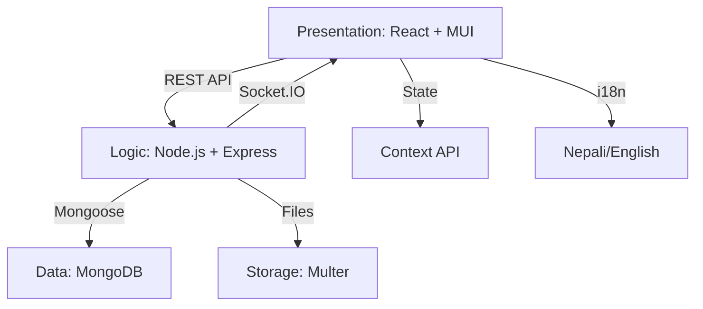

# Insight World: Institutional Grade News Ecosystem
## Technical Specification and Project Documentation

---

[](https://mongodb.com)
[](https://opensource.org/licenses/MIT)
[]()

**Insight World** is a high-performance news management platform engineered to replicate the operational discipline of a professional digital newsroom. Developed during an intensive internship at Imark Pvt Ltd, the system delivers a premium editorial experience through a strictly monitored content lifecycle and a sophisticated Glassmorphic interface.

---

## 1. Core Value Proposition

Insight World prioritizes professional integrity, transparency, and multi-lingual accessibility.
*   **Internationalization**: Native support for English and Nepali languages with real-time translation toggles.
*   **Editorial State Machine**: A rigid workflow (Draft -> Pending -> Published) ensures institutional quality control and content verification.
*   **System Accountability**: Every article and modification is cryptographically tethered to a verified user identity.

---

## 2. Technical Highlights

### Security and Identity Management
*   **Role-Based Access Control (RBAC)**: Granular permissions system for Administrators, Publishers, and Readers.
*   **JWT Authentication**: Stateless session management using industry-standard JSON Web Tokens for scalable security.
*   **Protected API Gateways**: Backend middleware enforces role-specific access to system resources and management tools.

### Professional User Experience
*   **Glassmorphic Design**: A modern visual language utilizing depth, mesh gradients, and backdrop filter blurs.
*   **Real-time Infrastructure**: Low-latency notification delivery for article approvals and audience engagement via Socket.IO.
*   **Adaptive Environment**: Intelligent Light and Dark mode implementation with persistent user-state storage.

### Intelligence and Analytics
*   **Moderation Command Center**: Centralized oversight of the master editorial queue and staff management.
*   **Performance Metrics**: Detailed data-driven insights for content engagement, including views, likes, and comments.

---

## 3. System Architecture & Documentation

For a comprehensive technical deep-dive into the API registry, content lifecycle state machine, and data models, please refer to the:
👉 **[System Architecture Blueprint (systemarchitecture.md)](./systemarchitecture.md)**

### High-Level Overview
The project follows a Decoupled Layered Architecture to ensure maintainability and modular growth.



---

## 4. System Directory Structure

```bash
intern_newsportal/
├── backend/                # Server-side logic & REST API
│   ├── config/             # Database & i18n initialization
│   ├── middleware/         # Auth, RBAC & Multer guards
│   ├── models/             # Mongoose Schema Definitions
│   ├── routes/             # Modular API traffic control
│   ├── uploads/            # Physical media repository
│   ├── utils/              # Backend service layer (Seeders, Schedulers)
│   ├── .env                # Environment variables
│   └── server.js           # Application Entry Point
├── client/                 # React Client Ecosystem (Frontend)
│   ├── public/             # Static HTML & public assets
│   ├── src/                # Component-based logic
│   └── package.json        # Frontend-specific dependencies
├── package.json            # Root orchestrator (Concurrently)
└── README.md               # Project documentation
```

---

## 5. Getting Started

### Prerequisites
*   Node.js (Version 16.x or higher)
*   MongoDB (Local installation or Atlas cluster)

### 2. First-Run Initialization
Follow these steps strictly for the initial setup:

```bash
# 1. Install Orchestrator Dependencies (Root)
npm install

# 2. Install Backend & Frontend Dependencies
npm run install:all

# 3. Database Seeding
# Populates the platform with initial Nepali content and system users.
npm run seed
```

### 3. Database & Environment Configuration
The platform requires a connection to a MongoDB instance. For local development, ensure your MongoDB service is running on the default port.

**Local MongoDB URL**: `mongodb://localhost:27017/news-portal`

Create a `.env` file inside the `backend/` directory with the following variables:
```env
MONGODB_URI=mongodb://localhost:27017/news-portal
JWT_SECRET=your_secure_jwt_key
PORT=5000
```

### Running the Platform
It is recommended to use two separate terminal windows for optimal log visibility.

#### Option A: Two Terminals (Recommended)
*   **Terminal 1 (Backend)**:
    ```bash
    npm run backend
    ```
*   **Terminal 2 (Frontend)**:
    ```bash
    npm run frontend
    ```

#### Option B: Combined Mode (Single Terminal)
*   **One Terminal**:
    ```bash
    npm run dev
    ```

---

## 6. Seeded Access Credentials
The following system accounts are available following the execution of the seeding script:

| Role | Email | Password | Identity |
| :--- | :--- | :--- | :--- |
| **Admin** | `admin@imark.com` | `password123` | Arun Subedi (System Oversight) |
| **Publisher** | `bimal@imark.com` | `password123` | Bimal Adhikari (Senior Editor) |
| **Publisher** | `pratima@imark.com` | `password123` | Pratima Pandey (Tech Correspondent) |
| **Reader** | `sushila@example.com` | `password123` | General Public Member |
| **Reader** | `dipesh@example.com` | `password123` | General Public Member |

---

## 7. API Testing (Postman)
A pre-configured Postman collection is included in the root directory to facilitate rapid API testing and development.

*   **File**: `Insight_World_API.postman_collection.json`
*   **How to Use**:
    1.  Open Postman and click **Import**.
    2.  Drag and drop the `.json` collection file.
    3.  The collection includes a `baseUrl` variable set to `http://localhost:5000/api`.
    4.  **Auto-Auth**: The `Login` request is configured with a test script that automatically saves the JWT token to the collection variables, so you don't have to manually copy-paste tokens for protected routes.

---

## 7. License and Attribution
Academic Project - Imark Internship Program (CDL Module).
Developed by the Imark Team under professional institutional supervision.
